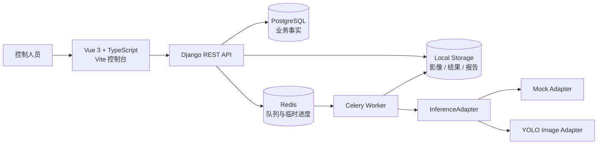

# 绿能先锋 · Green Pioneer

> 面向光伏电站控制人员的本地无人机巡检分析平台
>
> A local UAV inspection platform for photovoltaic power plants, covering AI-assisted detection, human review, task execution, anomaly tracking, and report generation.


绿能先锋不是一个孤立的图像识别页面，而是一条可追溯的光伏巡检业务闭环：

```text
巡检指令 / 影像上传
        ↓
任务草稿与人工确认
        ↓
AI 初筛（Mock / YOLO）
        ↓
低置信度结果人工复核
        ↓
组件地图与异常事件联动
        ↓
HTML / Excel / PDF 报告
```

## 项目亮点

- **人机协同识别**：低于 `0.75` 置信度的检测结果自动进入复核，未经确认不会进入最终统计或覆盖组件状态。
- **从识别到处置闭环**：识别结果可联动组件地图、清洗/维修事件、巡检任务、历史趋势和报告中心。
- **可替换的推理架构**：通过统一的 `InferenceAdapter` 接口隔离业务 API 与推理模型，默认可用离线 Mock 适配器，也支持接入 YOLO 图片推理。
- **后端约束业务状态**：任务、异常事件、账户审核和助手写操作均由后端进行权限与状态机校验，前端不直接修改业务事实。
- **本地优先**：固定业务查询和演示闭环可在本地运行；PostgreSQL 保存业务事实，Redis/Celery 负责异步任务和临时进度。
- **可审计、可复盘**：保留原始识别结果、人工改判、事件变化、任务时间线和报告数据快照。

## 核心功能

| 模块 | 功能 |
| --- | --- |
| 识别与复核 | JPG / PNG / WEBP 图片及 MP4 / MOV 视频上传、文件校验、Mock/YOLO 识别、低置信度复核、失败重试 |
| 电站地图 | 4 个区域、12 个阵列、240 块组件的状态网格，支持区域/阵列/组件逐级查看 |
| 异常事件 | 清洗与维修事件的开启、关闭、再次异常和处理记录 |
| 巡检任务 | 草稿 → 确认 → 执行 → 暂停/恢复 → 完成/失败的任务状态机，支持 S 形航线和模拟执行 |
| 智能助手 | 10 类本地规则意图，支持查询和生成任务/报告等结构化草稿，写操作需人工确认 |
| 报告中心 | HTML 网页报告、Excel 明细和 PDF 报告，统一使用已确认结果统计 |
| 历史与训练 | 组件状态趋势、事件历史、困难样本、数据集版本和离线训练演示 |
| 管理后台 | 账户审核、控制人员管理和审计日志 |

## 技术架构



### 技术栈

- **Frontend**：Vue 3、TypeScript、Vite、Vue Router、Pinia、Lucide
- **Backend**：Python、Django 5.2、Django REST Framework
- **Data & Jobs**：PostgreSQL 16、Redis 7、Celery
- **AI**：Mock 推理适配器、YOLO 图片推理适配器、Apple Silicon MPS 优先
- **Reports**：HTML、OpenPyXL、ReportLab
- **DevOps**：Docker Compose、Makefile、健康检查和演示数据脚本

## 本地运行

### 环境要求

- Node.js 20+
- Python 3.11+
- Docker Desktop（使用 PostgreSQL/Redis 容器时需要）

### 启动开发环境

```bash
cp .env.example .env
./scripts/bootstrap.sh
./scripts/start.sh
make seed-demo
```

启动后访问：

- 前端控制台：http://localhost:5173
- 后端健康检查：http://localhost:8000/api/v1/health
- Django Admin：http://localhost:8000/admin/

常用命令：

```bash
make test       # Django 测试 + 前端类型检查
make health     # 检查后端、Admin 和前端服务
make migrate    # 执行数据库迁移
make seed-demo  # 初始化幂等演示数据
make stop       # 停止本地服务
```

### Docker 模式

```bash
cp .env.example .env
./scripts/bootstrap.sh
./scripts/start.sh --docker
make seed-demo
```

Docker Compose 会启动 PostgreSQL、Redis 和后端服务；前端仍通过 Vite 在本地运行。

## 演示流程

建议按以下顺序体验项目：

1. 登录后进入“识别与助手”。
2. 创建或选择演示巡检任务，查看任务草稿、确认和 S 形航线。
3. 上传图片或视频，观察上传、识别和复核状态变化。
4. 对低置信度结果执行人工确认或改判。
5. 打开“电站地图”，查看组件状态和异常事件联动。
6. 在“报告中心”生成网页、Excel 或 PDF 报告。
7. 在“历史数据”中查看状态趋势和事件时间线。

默认演示数据包含 4 个区域、12 个阵列、240 块组件和 30 天历史记录。演示识别结果会明确标记为 Mock/演示数据。

## 接入真实 YOLO 图片模型

项目默认使用 Mock 适配器保证业务闭环可离线运行。若已经准备好模型权重，可以将模型放入本地 `data/models/` 目录，并通过管理命令登记：

```bash
make register-yolo
make celery
```

模型权重、巡检影像、识别结果和报告文件不提交到 Git。真实模型接入不会改变现有业务 API。

## 关键设计决策

### 1. 先确认，再写入

识别结果、助手动作和模型切换都设置人工确认边界。低置信度结果在复核前不会进入最终统计；助手创建任务、关闭事件或生成报告时先生成结构化草稿，再等待控制人员确认。

### 2. 模型与业务解耦

业务层只依赖 `InferenceAdapter` 的输入输出协议。Mock 适配器用于可重复的离线演示，YOLO 适配器负责真实图片推理，后续可以在不改变业务 API 的情况下替换模型实现。

### 3. 明确数据职责

PostgreSQL 保存账户、电站、组件、识别、事件、任务和报告等业务事实；Redis 只承担队列、临时进度和短期缓存；大文件保存在本地文件目录。

### 4. 统一统计口径

网页、地图、历史趋势和导出报告共享已确认结果与报告快照，减少“页面数字”和“报告数字”不一致的问题。

## 当前边界与路线图

当前版本重点展示稳定、可追溯的 V1 业务闭环，以下能力仍属于后续方向：

- 视频抽帧、目标跟踪和结果视频的真实模型处理；
- 真实 YOLO 训练、评估和模型版本对比；
- 接入真实无人机飞控、GPS/GIS 和红外复检设备；
- 面向公网部署的安全加固、多电站和多角色支持；
- 更完整的端到端测试、故障注入和持续集成流程。

普通 RGB 图像不能直接用于专业热斑确诊。对于可见黑化现象，系统统一使用“疑似热斑，建议红外复检”的谨慎表述。

## 项目目录

```text
.
├── backend/              # Django API、业务模型、服务和测试
├── frontend/             # Vue 3 前端控制台
├── ai_worker/            # AI Worker 相关运行入口
├── data/                 # 本地影像、结果、报告和模型目录（不提交实际数据）
├── docs/                 # 产品需求、技术方案和接口说明
├── scripts/              # 初始化、启动、停止、健康检查和演示数据脚本
├── docker-compose.yml    # PostgreSQL + Redis + 后端容器编排
├── Makefile              # 常用开发命令
└── .env.example          # 环境变量模板
```

## 安全与公开仓库说明

- 不要提交 `.env`、API Key、数据库密码或模型权重。
- 不要提交真实巡检影像、包含个人信息的数据和本地数据库文件。
- `data/` 目录只保留目录结构，公开仓库中的识别结果均应使用演示数据。
- 默认配置仅用于本地开发，部署到公网前必须更换密钥、密码和允许访问的域名。

## License

License 尚未确定。若将本项目作为个人作品公开展示，建议在确认代码和素材归属后补充 MIT License 或其他适合的开源协议。
