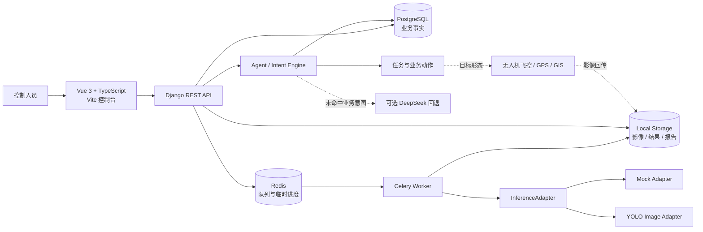

# 绿能先锋 · Green Pioneer

> 面向光伏电站控制人员的本地 AI 智能体巡检与运维协同平台
>
> An agent-assisted local UAV inspection and operations platform for photovoltaic power plants, combining natural-language interaction, AI-assisted detection, human review, task execution, anomaly tracking, and report generation.


绿能先锋面向未来的光伏电站智能运维场景，目标是让控制人员通过自然语言完成“询问情况—制定计划—调用无人机—分析影像—确认异常—生成报告”的完整工作流。AI 智能体作为统一的人机交互入口，连接电站数据、巡检任务、视觉模型、异常事件和报告服务，把一次巡检从分散操作组织成可追踪、可确认、可复盘的业务流程。

目标业务闭环：

```text
自然语言问询 / 巡检指令
        ↓
智能体意图解析与动作草稿
        ↓
控制人员确认计划并启动巡检
        ↓
无人机执行航线并回传影像
        ↓
AI 初筛（Mock / YOLO）
        ↓
低置信度结果人工复核
        ↓
组件地图与异常事件联动
        ↓
HTML / Excel / PDF 报告
```

## 产品愿景与目标能力

### 1. 面向运维人员的 AI 智能体

控制人员无需记忆复杂菜单和接口，可以直接用自然语言与系统协作：

- “查看当前电站总体运行情况。”
- “北区有哪些组件需要维修？”
- “安排无人机巡查北区全部阵列。”
- “把这次巡检任务启动起来。”
- “生成本次巡检的 PDF 分析报告。”

智能体负责理解意图、提取电站/区域/阵列/任务/时间范围等上下文，调用相应的业务工具，并将下一步动作整理成可检查的计划。查询类问题直接返回业务数据；创建任务、启动巡检、关闭事件、导出报告等操作先展示动作草稿，再由控制人员确认。

### 2. 从自然语言到无人机巡检任务

智能体可以将“巡查哪里、检查什么、什么时候执行”等自然语言要求转换为结构化巡检计划，自动关联电站、区域、阵列、航点和素材。任务中心负责展示计划范围、路线、进度、覆盖率、异常数量和执行时间线，并支持暂停、恢复、取消、补传素材和失败重试。

目标状态下，系统可以进一步对接真实无人机飞控、GPS/GIS 和任务调度服务，实现从任务确认到航线下发、影像回传和任务闭环的自动协同。当前版本以模拟航线执行验证业务流程。

### 3. AI 视觉识别与人机协同

平台接收无人机图片和视频，对光伏组件进行视觉初筛，输出“正常、需要清洗、需要维修”等业务状态，并保留模型版本、置信度、边界框、原始媒体和结果媒体。

识别不是最终裁决：低置信度结果进入人工复核，控制人员可以确认或改判类别；所有改判保留原始结果、最终结果、操作者、时间和备注，形成模型与人工共同参与的可信工作流。

目标状态下，平台支持图片、视频关键帧、异常截图、结果视频、持续学习和多模型版本对比。普通 RGB 影像对热斑等专业问题只提供风险提示，并引导红外复检，不替代专业检测结论。

### 4. 电站数字化地图与异常闭环

系统以电站—区域—阵列—组件为核心对象，建立可视化的光伏资产地图：

- 查看全站运行概况和区域健康度；
- 按区域、阵列、行列定位组件；
- 查看组件当前状态、最近识别、历史变化和关联任务；
- 将识别结果转化为清洗或维修异常事件；
- 跟踪事件开启、处理、关闭和再次异常；
- 结合巡检覆盖率和异常分布辅助运维决策。

### 5. 报告、分析与管理决策

每次巡检都可以沉淀为结构化报告，包含任务信息、路线与覆盖率、区域/阵列汇总、三分类统计、异常明细、关键影像和处理建议，并支持网页查看、Excel 明细和 PDF 分享。

在更完整的产品形态中，历史数据模块还可以提供按电站、区域、阵列和时间范围的趋势分析，用于发现重复异常、评估清洗维修效果和辅助制定下一轮巡检计划。

### 6. 数据集、训练与模型生命周期

平台将低置信度样本、失败样本和人工改判样本沉淀为困难样本池，支持标注、数据集版本、训练记录、评估指标、候选模型、启用/回退和审计追踪。这样，巡检系统不仅消费模型，也能持续积累数据，形成“使用—复核—学习—升级”的模型迭代闭环。

### 7. 面向实际部署的安全与可靠性

目标产品具备账户审核、角色权限、电站数据隔离、操作审计、文件校验、幂等重试、任务恢复、服务健康检查和本地离线降级能力。业务事实由持久化数据库保存，消息队列只负责异步任务和临时状态，确保服务重启不会破坏历史巡检记录。

## 项目亮点

- **人机协同识别**：低于 `0.75` 置信度的检测结果自动进入复核，未经确认不会进入最终统计或覆盖组件状态。
- **自然语言智能体**：内置本地规则型 Intent Engine，支持询问电站概况、异常和任务状态，也支持创建/启动/暂停任务、生成报告等结构化动作。
- **智能体控制边界**：涉及创建或改变任务、生成报告等写操作先生成可检查的动作草稿，控制人员确认后才执行；创建任务、确认任务和模拟执行仍遵循各自的业务状态机。
- **从识别到处置闭环**：识别结果可联动组件地图、清洗/维修事件、巡检任务、历史趋势和报告中心。
- **可替换的推理架构**：通过统一的 `InferenceAdapter` 接口隔离业务 API 与推理模型，默认可用离线 Mock 适配器，也支持接入 YOLO 图片推理。
- **后端约束业务状态**：任务、异常事件、账户审核和助手写操作均由后端进行权限与状态机校验，前端不直接修改业务事实。
- **本地优先**：固定业务查询和演示闭环可在本地运行；PostgreSQL 保存业务事实，Redis/Celery 负责异步任务和临时进度。
- **可审计、可复盘**：保留原始识别结果、人工改判、事件变化、任务时间线和报告数据快照。

## 产品能力地图

| 产品域 | 目标能力 | 当前 V1 实现 |
| --- | --- | --- |
| 智能体交互 | 自然语言问询、任务规划、巡检调度、异常处置建议、报告生成和业务工具编排 | ✅ 10 类本地规则意图、槽位提取、结构化动作草稿，可选 DeepSeek 普通对话回退 |
| 无人机巡检 | 从任务确认到航线下发、飞行状态、影像回传和任务闭环 | 🟡 任务状态机、S 形路线和模拟执行；真实飞控/GPS/GIS 待接入 |
| 视觉识别 | 图片、视频、关键帧和结果媒体的多模态分析 | 🟡 Mock/YOLO 图片推理和复核闭环；完整视频抽帧/跟踪/结果视频待实现 |
| 资产地图 | 4 个区域、12 个阵列、240 块组件的状态网格，支持区域/阵列/组件逐级查看 | ✅ 演示电站地图、组件状态和历史数据 |
| 异常事件 | 清洗/维修异常的发现、确认、派生、关闭、再次异常和处置留痕 | ✅ 识别复核后联动事件，支持手动关闭和历史追踪 |
| 巡检任务 | 草稿 → 确认 → 执行 → 暂停/恢复 → 完成/失败的任务状态机 | ✅ 智能体创建任务，任务流程确认、启动并执行模拟巡检 |
| 报告与分析 | 网页、Excel、PDF 报告，历史趋势、区域健康度和运维决策分析 | ✅ HTML/Excel/PDF；分类统计使用已确认结果，并保留识别总数快照 |
| 数据与模型生命周期 | 困难样本、标注、数据集版本、训练评估、模型启用/回退和审计 | 🟡 数据集/训练流程和离线训练演示，正式训练闭环待完善 |
| 权限与可靠性 | 账户审核、数据隔离、操作审计、失败重试、离线降级和健康检查 | ✅ 账户审核、权限控制、审计记录、重试和服务健康检查 |

## 产品技术架构（目标形态）



### 技术栈

- **Frontend**：Vue 3、TypeScript、Vite、Vue Router、Pinia、Lucide
- **Backend**：Python、Django 5.2、Django REST Framework
- **Data & Jobs**：PostgreSQL 16、Redis 7、Celery
- **AI & Agent**：本地规则型 Intent Engine、槽位提取、结构化动作草稿、可选 DeepSeek 对话回退、Mock 推理适配器、YOLO 图片推理适配器、Apple Silicon MPS 优先
- **Reports**：HTML、OpenPyXL、ReportLab
- **DevOps**：Docker Compose、Makefile、健康检查和演示数据脚本

## 本地运行

### 环境要求

- Node.js 20+
- Python 3.11+
- Docker Desktop（使用 PostgreSQL/Redis 容器时需要）

### 启动开发环境

```bash
cp .env.example .env
./scripts/bootstrap.sh
./scripts/start.sh
make seed-demo
```

启动后访问：

- 前端控制台：http://localhost:5173
- 后端健康检查：http://localhost:8000/api/v1/health
- Django Admin：http://localhost:8000/admin/

常用命令：

```bash
make test       # Django 测试 + 前端类型检查
make health     # 检查后端、Admin 和前端服务
make migrate    # 执行数据库迁移
make seed-demo  # 初始化幂等演示数据
make stop       # 停止本地服务
```

### Docker 模式

```bash
cp .env.example .env
./scripts/bootstrap.sh
./scripts/start.sh --docker
make seed-demo
```

Docker Compose 会启动 PostgreSQL、Redis 和后端服务；前端仍通过 Vite 在本地运行。

## 演示流程

建议按以下顺序体验项目：

1. 登录后进入“识别与助手”。
2. 向智能体输入“查询当前电站有哪些维修异常”或“创建北区巡检任务”。
3. 查看智能体返回的电站数据，或检查它解析出的区域/阵列槽位和任务草稿。
4. 确认创建任务后，在任务中心再次确认并启动任务，再执行模拟巡检，观察任务进度与 S 形航线。
5. 上传图片或视频，观察上传、识别和复核状态变化；当前视频上传与真实视频抽帧处理是两个不同能力。
6. 对低置信度结果执行人工确认或改判，并在“电站地图”中查看状态和事件联动。
7. 在“报告中心”生成网页、Excel 或 PDF 报告，再到“历史数据”查看趋势和事件时间线。

默认演示数据包含 4 个区域、12 个阵列、240 块组件和 30 天、共 7,200 条组件状态历史记录。演示识别结果会明确标记为 Mock/演示数据。

## 接入真实 YOLO 图片模型

项目默认使用 Mock 适配器保证业务闭环可离线运行。若已经准备好模型权重，可以将模型放入本地 `data/models/` 目录，并通过管理命令登记：

```bash
make register-yolo
make celery
```

模型权重、巡检影像、识别结果和报告文件不提交到 Git。当前 YOLO 适配器以图片推理为主，并返回单次推理结果；视频抽帧、跟踪、关键帧和结果视频属于后续处理能力。真实模型接入不会改变现有业务 API。

## 关键设计决策

### 1. 智能体先提议，再执行

智能体不是直接执行器，而是业务协作入口。查询类问题可以直接读取当前业务数据；创建任务、启动/暂停任务或生成报告等写操作先生成结构化动作草稿，展示动作内容并等待控制人员确认。确认后才调用任务或报告服务执行；任务创建、任务启动和模拟巡检仍由独立的任务接口推进。

### 2. 模型与智能体、业务解耦

智能体通过规则意图、槽位和结构化动作与业务服务交互，未命中固定业务意图时才可回退到 DeepSeek 普通对话；推理层通过 `InferenceAdapter` 与业务 API 解耦。Mock 适配器用于可重复的离线演示，YOLO 适配器负责真实图片推理，后续可以在不改变业务 API 的情况下替换模型或扩展智能体工具。

### 3. 明确数据职责

PostgreSQL 保存账户、电站、组件、识别、事件、任务和报告等业务事实；Redis 只承担队列、临时进度和短期缓存；大文件保存在本地文件目录。

### 4. 统一统计口径

网页、地图、历史趋势和导出报告共享统一的数据口径与报告快照，分类统计只使用已确认结果，减少“页面数字”和“报告数字”不一致的问题。

## 当前边界与路线图

当前版本重点展示稳定、可追溯的 V1 智能体巡检闭环，以下能力仍属于后续方向：

- 更通用的自主规划 Agent；当前智能体以 10 类本地规则意图为主，非固定业务问题可选用 DeepSeek 进行普通对话回退；
- 将助手解析出的区域/阵列范围用于 S 形路线的精确过滤；当前任务会保存范围描述，但路线服务按所属电站生成航点；
- 视频抽帧、目标跟踪和结果视频的真实模型处理；
- 真实 YOLO 训练、评估和模型版本对比；
- 接入真实无人机飞控、GPS/GIS 和红外复检设备；当前“启动巡查”对应的是经过人工确认的模拟巡检任务，不代表真实飞控已经接入；
- 面向公网部署的安全加固、多电站和多角色支持；
- 更完整的端到端测试、故障注入和持续集成流程。

普通 RGB 图像不能直接用于专业热斑确诊。对于可见黑化现象，系统统一使用“疑似热斑，建议红外复检”的谨慎表述。

## 项目目录

```text
.
├── backend/              # Django API、业务模型、服务和测试
├── frontend/             # Vue 3 前端控制台
├── ai_worker/            # AI Worker 相关运行入口
├── data/                 # 本地影像、结果、报告和模型目录（不提交实际数据）
├── docs/                 # 产品需求、技术方案和接口说明
├── scripts/              # 初始化、启动、停止、健康检查和演示数据脚本
├── docker-compose.yml    # PostgreSQL + Redis + 后端容器编排
├── Makefile              # 常用开发命令
└── .env.example          # 环境变量模板
```

## 安全与公开仓库说明

- 不要提交 `.env`、API Key、数据库密码或模型权重。
- 不要提交真实巡检影像、包含个人信息的数据和本地数据库文件。
- `data/` 目录只保留目录结构，公开仓库中的识别结果均应使用演示数据。
- 默认配置仅用于本地开发，部署到公网前必须更换密钥、密码和允许访问的域名。

## License

License 尚未确定。若将本项目作为个人作品公开展示，建议在确认代码和素材归属后补充 MIT License 或其他适合的开源协议。
