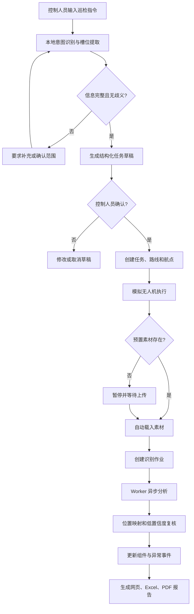
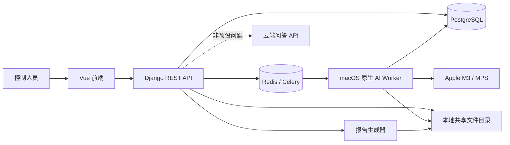
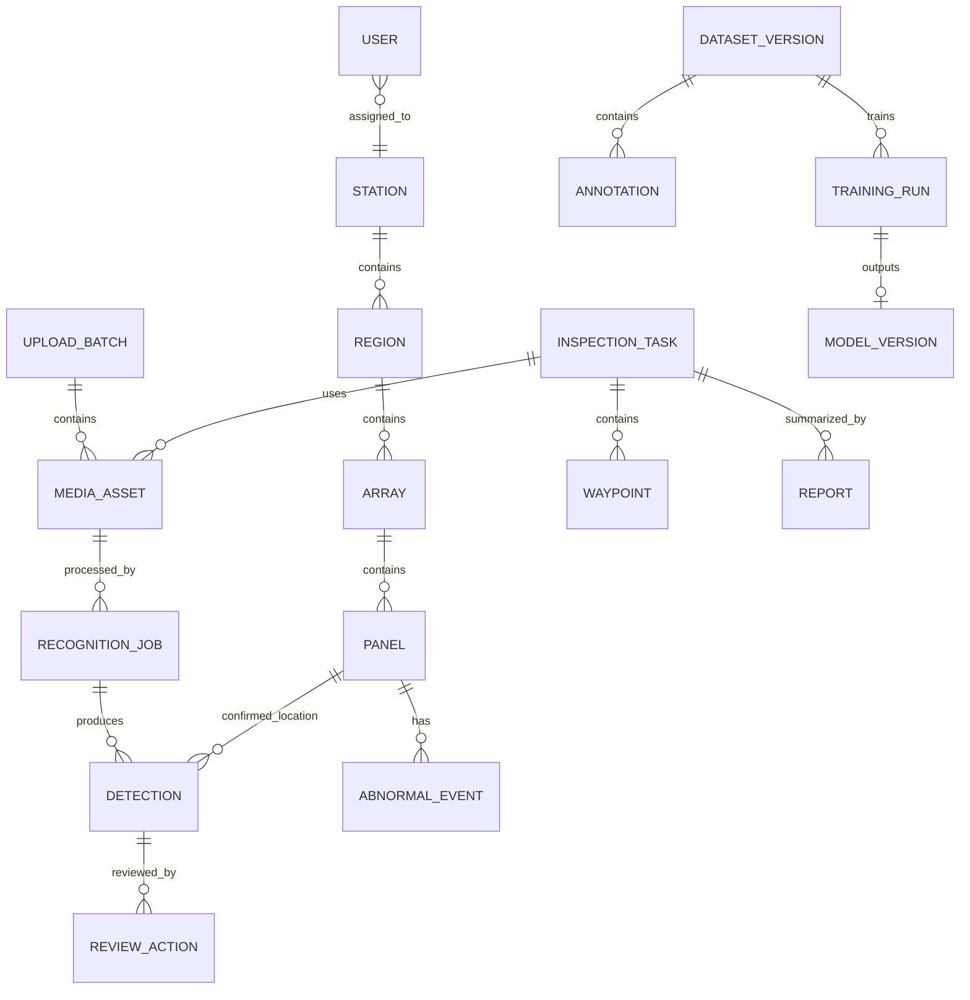

# 绿能先锋 V1 完整产品需求与技术实施方案

> 文档类型：产品需求文档（PRD）+ 技术实施方案 + 迭代验收基线  
> 产品名称：绿能先锋  
> 版本：V1.0  
> 文档状态：待最终确认，确认后方可编码  
> 编制日期：2026-08-05  
> 目标环境：Apple M3、24 GB 内存的 MacBook Air，本地单机部署  
> 视觉基线：`opendesign/mockups/solar-inspection-styles/index.html`  
> 上位需求基线：`docs/绿能先锋_V1需求规格说明书.md`

---

## 1. 文档目的

本文档将“绿能先锋”V1 的业务目标、用户流程、功能范围、业务规则、页面拆分、数据模型、接口边界、技术架构、项目目录、开发顺序、质量要求、风险和验收标准统一为一份可执行基线。

本文档确认后，开发工作必须遵循以下原则：

1. 未写入本文档的新功能不自动进入 V1。
2. 影响数据模型、状态机、权限、部署方式或核心演示链路的变更，必须先更新本文档再编码。
3. 纯视觉、文案、阈值和演示数据调整可通过配置迭代，但不得突破能力边界。
4. 先完成可重复、可演示的端到端闭环，再提高模型精度和扩展训练平台。
5. 所有验收以本文档的业务规则和验收用例为准，不以单个页面“看起来完成”为准。

---

## 2. 产品概述

### 2.1 产品定位

“绿能先锋”是一套面向光伏电站控制人员的本地无人机巡检分析系统。系统接收普通 RGB 图片和视频，通过 YOLO 对整块光伏组件进行检测，输出三类业务状态：

- 正常；
- 需要清洗；
- 需要维修。

系统提供巡检任务生成与确认、模拟无人机执行、素材上传与自动分析、低置信度结果复核、电站组件状态地图、异常事件管理、报告导出、困难样本标注、模型训练管理和本地规则型文字助手。

### 2.2 V1 核心价值

V1 的价值不是替代专业红外检测，也不是实现真实无人机飞控，而是在一台本地 Mac 上稳定展示以下业务闭环：

```text
文字下达巡检指令
→ 本地规则解析
→ 生成结构化任务草稿
→ 控制人员人工确认
→ 生成 S 形路线并模拟执行
→ 自动载入或人工上传巡检素材
→ 异步识别与进度展示
→ 人工复核低置信度结果
→ 更新组件状态和异常事件
→ 生成网页、Excel、PDF 报告
```

### 2.3 建设目标

1. 在 2～3 分钟答辩时间内稳定演示完整闭环。
2. 核心演示功能断网可运行。
3. 业务模型能够支持未来接入真实无人机、GPS、GIS、红外设备和更细粒度模型。
4. 控制人员只需确认任务、复核不确定结果和处理异常。
5. 模型未达到最终精度时，仍可通过明确标记的模拟适配器完成全流程演示。

### 2.4 成功指标

| 维度 | V1 指标 |
|---|---|
| 演示 | 2～3 分钟内完成一次预置任务闭环 |
| 离线 | 断网时可登录、建任务、识别、复核、看地图和导出报告 |
| 上传 | 一次支持多张图片和最多一个 2～3 分钟、1080p 视频 |
| 进度 | 展示排队、上传、识别、复核、完成、失败及真实百分比 |
| 检测 | 图片和结果视频展示组件框、三类标签和置信度 |
| 视频 | 默认 3 FPS 抽样，可配置为每秒 2～5 帧，并使用跟踪补框 |
| 定位 | 识别结果能够映射到电站、区域、阵列和组件编号 |
| 地图 | 展示 4 区、12 阵列、240 块组件的当前状态 |
| 报告 | 生成网页报告，并导出 Excel 和 PDF |
| 助手 | 10 类预置意图离线可用，非预置问题才允许云端回退 |
| 模型 | 阶段目标：总体准确率 ≥85%，维修类召回率 ≥90% |
| 可恢复性 | Worker 异常后作业可重试，Redis 丢失不导致业务历史丢失 |

模型指标必须在独立验证素材上测量。同一视频的相邻帧不得分别进入训练集和验证集。

---

## 3. 用户、角色与权限

### 3.1 控制人员

V1 只有一个前台业务角色：控制人员。

控制人员可执行：

- 注册、登录、退出和修改密码；
- 上传图片、视频和区域备注；
- 查看识别进度和结果；
- 复核、修改、确认和归档识别结果；
- 查询电站、区域、阵列和组件状态；
- 创建、确认、执行、取消巡检任务；
- 查看和导出报告；
- 使用困难样本、标注和训练管理功能；
- 使用文字助手查询数据或生成任务草稿；
- 手动关闭清洗或维修事件。

### 3.2 管理员

管理员不提供独立前台工作台，只使用 Django Admin：

- 审核、拒绝、启用和停用账户；
- 分配控制人员所属电站；
- 查看必要的后台数据和审计记录。

### 3.3 账户状态

| 状态 | 能否登录 | 前台提示 |
|---|---:|---|
| 待审核 | 否 | 账户正在等待管理员审核 |
| 已通过 | 是 | 正常进入系统 |
| 已拒绝 | 否 | 注册申请未通过，请联系管理员 |
| 已停用 | 否 | 账户已停用，请联系管理员 |

### 3.4 权限规则

1. 用户只能访问所属电站的数据。
2. 所有关键修改必须记录操作者和时间。
3. 模型启用、识别结果修改、异常事件关闭和任务确认必须审计。
4. 未通过审核的账户不得通过 API 绕过前端登录限制。

---

## 4. 产品范围

### 4.1 V1 范围内

- 账户注册、审核和登录；
- 单电站、四区域、十二阵列、二百四十块组件；
- 图片和视频批量上传；
- 区域备注解析和人工确认；
- 异步识别、真实进度和失败重试；
- 模拟 Worker 与真实 YOLO Worker 可替换；
- 三分类检测和整块组件框选；
- 视频抽帧、目标跟踪、结果视频和异常关键帧；
- 低置信度人工复核；
- 电站组件网格地图和 S 形路线；
- 文字生成任务草稿并人工确认；
- 预置素材自动载入和素材缺失暂停续传；
- 异常事件开启、处理和自动关闭；
- 网页、Excel 和 PDF 报告；
- 10 类本地助手意图和云端 API 回退；
- 困难样本、标注、数据集版本、训练记录和模型切换；
- 一键启动、初始化、重置和健康检查。

### 4.2 V1 明确不做

- 真实无人机飞控或实时摄像头接入；
- 通过普通视觉画面猜测区域或组件编号；
- 红外热成像诊断；
- 将可见黑化直接确诊为热斑；
- 积灰、鸟粪、裂纹等细粒度原因模型；
- 自动上传训练数据至云端；
- 多种前台业务角色；
- 公网生产部署和移动端应用；
- 正式工单审批、签字和盖章流程；
- 将本地规则助手描述成通用大语言模型；
- 复杂 GIS 作为 V1 主地图。

---

## 5. 核心业务对象与编号规则

### 5.1 演示电站结构

- 1 个演示电站；
- 东、南、西、北 4 个区域；
- 每个区域 3 个阵列；
- 每个阵列 4 行 × 5 列，共 20 块组件；
- 总计 12 个阵列、240 块组件；
- 初始化 30 天历史数据。

### 5.2 编号规则

- 数据库完整编号示例：`A2-R01-C01`；
- 页面短编号示例：`A2-001`；
- 完整编号在所属电站和区域范围内唯一；
- 页面短编号仅用于展示，不作为全局唯一键；
- 数据库应使用内部主键建立关联，不使用展示编号充当外键。

### 5.3 位置来源优先级

位置不得由普通组件画面猜测，按以下顺序确认：

1. 已确认巡检任务及航点；
2. 上传备注的解析结果；
3. 文件元数据或未来 GPS、二维码；
4. 控制人员人工补充确认。

位置缺失或存在歧义时，识别结果可以生成，但不得静默写入某一组件的当前状态，必须进入待确认状态。

---

## 6. 核心业务规则

### 6.1 视觉识别规则

YOLO 检测对象固定为整块光伏组件，只允许三个类别：

| 模型类别 | 业务含义 | 展示颜色 |
|---|---|---|
| `normal` | 正常 | 绿色 |
| `cleaning` | 需要清洗 | 橙色 |
| `repair` | 需要维修 | 红色 |

积灰、鸟粪、遮挡、裂纹和可见黑化等只能作为 `reason` 辅助字段，不增加为 V1 模型类别。

### 6.2 RGB 能力边界

普通 RGB 图片不能用于专业热斑确诊。发现明显黑点或黑化时：

- 业务类别可以标记为“需要维修”；
- 对外描述必须使用“检测到可见黑化，疑似热斑，建议红外复检”；
- 报告和助手不得使用“已发现热斑”或同等确定性表述。

### 6.3 低置信度规则

- 默认阈值为 0.75；
- 阈值可在系统设置中调整；
- 低于阈值的检测进入人工复核；
- 未复核前不得计入最终业务统计；
- 修改后的结果保留原始类别、原始置信度和修改审计记录。

### 6.4 识别历史与当前状态

1. 每次识别产生不可删除的历史识别记录。
2. 组件当前状态由已确认的最新有效识别和异常事件共同维护。
3. 识别结果不得直接覆盖历史记录。
4. 同一组件可以多次发生异常，每次异常建立独立事件。

### 6.5 异常事件规则

- 清洗和维修使用独立异常事件记录；
- 控制人员可以手动标记已处理；
- 后续巡检确认正常时，可以自动关闭当前异常；
- 自动关闭必须记录关闭原因、时间和关联识别记录；
- 已关闭事件不复用，再次异常时创建新事件；
- V1 不做即时报警，只累计展示待处理数量。

### 6.6 智能体动作规则

所有可能修改业务状态的助手动作必须：

1. 先生成结构化草稿；
2. 向控制人员展示影响范围；
3. 等待人工确认；
4. 确认后执行；
5. 记录对话、草稿、确认人、执行结果和时间。

查询类动作可直接返回结果；创建任务、关闭事件、生成导出等写操作必须遵循人工确认边界。

### 6.7 数据事实来源

- PostgreSQL：业务事实来源；
- Redis：队列、临时进度、锁和短期缓存；
- 本地文件目录：原始媒体、结果媒体、截图、训练数据和模型权重；
- Redis 丢失不得造成任务历史、识别结果或业务状态丢失；
- 大型文件不得写入 Redis，队列只传 ID 或共享文件路径。

---

## 7. 页面信息架构与功能拆分

### 7.1 全局框架

视觉采用成熟、克制的深色工业控制台风格，以 V4 静态原型为基线。

全局区域：

- 左上角绿色圆形闪电图标和“绿能先锋”；
- 左侧主导航；
- 顶部页面标题、服务状态，以及右上角“控制人员 + 当前账户名称”；
- 主内容区；
- 全局消息、确认弹窗和错误提示。

左侧导航顺序：

1. 识别与助手；
2. 任务中心；
3. 报告中心；
4. 电站地图；
5. 模型训练；
6. 历史数据；
7. 系统设置。

### 7.2 登录与注册

#### 登录

- 账号、密码、记住登录状态；
- 明确展示待审核、拒绝、停用和密码错误；
- 登录成功跳转到“识别与助手”。

#### 注册

- 账号、姓名、密码、确认密码；
- 校验账号唯一性和密码规则；
- 注册成功提示等待管理员审核；
- 不允许自行选择或修改所属电站。

### 7.3 识别与助手

采用三栏专业控制台布局。

#### 主识别区

- 拖拽或选择文件；
- 多张图片加最多一个视频；
- 提交前填写区域备注；
- 展示文件类型、大小和校验错误；
- 上传后切换为当前处理结果；
- 文件卡片持续展示本批次全部素材；
- 状态包括待上传、上传中、排队中、识别中、待复核、已完成、失败；
- 视频展示处理百分比、当前帧或时间和状态；
- 展示原始媒体、结果媒体、三分类统计和异常关键帧；
- 支持确认、修改、归档和失败重试。

#### 智能助手区

- V1 仅支持文字输入；
- 展示本地规则状态、云端 API 状态和回答来源；
- 本地规则优先；
- 任务和其他写动作必须先展示草稿；
- 云端不可用时明确提示，不得编造答案。

#### 批次与历史区

- 显示近期上传批次；
- 可按状态筛选；
- 可恢复到某批次查看结果；
- 批次失败不影响已完成文件。

### 7.4 任务中心

#### 列表

- 任务编号、区域、阵列、状态和进度；
- 创建、开始和完成时间；
- 异常数量；
- 状态筛选和关键词检索。

#### 详情

- 任务范围；
- S 形路线和航点；
- 模拟无人机当前位置和覆盖率；
- 关联素材；
- 识别进度；
- 异常统计；
- 事件时间线；
- 取消、重试和继续上传操作。

#### 素材处理

- 有预置素材时自动载入并分析；
- 无预置素材时进入“等待素材”；
- 上传完成后从暂停位置继续，不新建重复任务。

### 7.5 报告中心

#### 列表

- 报告编号、关联任务、生成状态、生成时间；
- 网页查看、Excel 下载和 PDF 下载；
- 失败原因和重新生成。

#### 报告内容

- 任务基本信息；
- 区域、阵列和路线；
- 三分类统计；
- 区域和阵列汇总；
- 已确认异常明细；
- 关键截图；
- 智能建议；
- RGB 能力边界说明。

Excel 至少包括：

- “组件明细”；
- “汇总统计”。

PDF 不设置签字或盖章位置。

### 7.6 电站地图

- 使用可控的光伏阵列俯视网格，不以复杂 GIS 为主视图；
- 支持电站、区域、阵列、行列和组件逐级锁定；
- 状态颜色包括正常、需要清洗、需要维修、识别中和未知；
- 点击组件展示当前状态、最近识别时间、异常原因、历史记录和关联任务；
- 展示固定 S 形路线、模拟无人机位置和覆盖率；
- 地图状态来自 PostgreSQL 中的当前业务状态。

### 7.7 模型训练

#### 困难样本池

- 仅收集低置信度、识别失败和人工修改过的样本；
- 进行近重复过滤；
- 支持图片和视频关键帧导入。

#### 标注

- 使用已有模型生成候选框；
- 支持新增、移动、缩放和删除框；
- 类别固定为三类；
- 保存标注人、时间和修改记录。

#### 数据集与训练

- 数据集版本和来源记录；
- 训练、验证划分；
- YOLO 格式导出；
- 创建本地训练任务；
- 展示 Loss、Precision、Recall、mAP 和混淆矩阵；
- 本地训练过慢时，只生成标准数据包和命令，由用户手动上传云端 GPU。

#### 模型版本

- 查看权重、类别、指标和创建时间；
- 启用前人工确认；
- 记录启用时间和操作者；
- 保留回退到上一版本的能力。

### 7.8 历史数据

- 展示组件识别历史；
- 展示异常事件开启和关闭记录；
- 展示区域近 7 天和 30 天趋势；
- 支持按区域、阵列、组件、任务、类别和日期筛选；
- 历史记录只读，业务更正通过复核或事件处理完成。

### 7.9 系统设置

- 低置信度阈值，默认 0.75；
- 视频抽帧率，默认 3 FPS，范围 2～5 FPS；
- 原始和结果视频保留天数，默认 7 天；
- 云端 API 可用状态，不在页面明文显示密钥；
- 当前启用模型；
- 服务健康状态；
- 修改密码。

---

## 8. 端到端业务流程

### 8.1 指令驱动巡检



### 8.2 手工上传识别

```text
选择图片/视频 → 填写备注 → 服务端校验 → 上传完成
→ 创建识别作业 → Worker 分析 → 展示结果
→ 位置确认与低置信度复核 → 更新业务状态 → 可生成报告
```

### 8.3 异常处理

```text
已确认异常识别 → 创建或延续当前异常事件
→ 控制人员处理并手动关闭
或
→ 后续巡检确认正常并自动关闭
→ 保留全部历史与关闭原因
```

---

## 9. 状态机定义

### 9.1 巡检任务状态

| 状态 | 含义 | 允许后续状态 |
|---|---|---|
| 草稿 | 尚未确认 | 待确认、已取消 |
| 待确认 | 等待人工确认 | 已排队、已取消 |
| 已排队 | 已进入执行队列 | 执行中、失败、已取消 |
| 执行中 | 模拟无人机执行 | 等待素材、分析中、失败、已取消 |
| 等待素材 | 无预置素材 | 分析中、失败、已取消 |
| 分析中 | 已关联识别作业 | 待复核、已完成、失败 |
| 待复核 | 存在未确认结果 | 已完成、失败 |
| 已完成 | 全部必要步骤完成 | 终态 |
| 已取消 | 人工取消 | 终态 |
| 失败 | 无法继续 | 已排队（重试）、终止 |

### 9.2 媒体文件状态

```text
待上传 → 上传中 → 排队中 → 识别中 → 待复核 → 已完成
                       ↘ 失败 → 重试后排队中
```

### 9.3 识别作业状态

```text
已创建 → 已排队 → 运行中 → 待复核 → 已完成
                      ↘ 失败 → 重试中 → 已排队
```

### 9.4 报告状态

```text
待生成 → 生成中 → 已完成
               ↘ 失败 → 待生成
```

### 9.5 训练任务状态

```text
草稿 → 已排队 → 训练中 → 已完成
                 ↘ 已取消 / 失败
```

所有状态转换在后端校验，前端不得通过任意字段更新绕过状态机。

---

## 10. 本地助手需求

### 10.1 本地处理能力

本地助手由意图识别、槽位提取、数据库查询、统计计算、任务草稿生成和模板回答组成，不依赖通用本地大模型。

至少支持以下意图：

1. 查询某区域当前状况；
2. 查询某区域近 7 天或 30 天清洁趋势；
3. 查询待清洗组件；
4. 查询待维修组件；
5. 查询指定组件历史；
6. 生成一个或多个区域的巡检任务草稿；
7. 查询任务进度；
8. 生成或导出巡检报告草稿；
9. 查询困难样本、标注或训练进度；
10. 生成关闭清洗或维修事件的动作草稿。

### 10.2 槽位

主要槽位包括：

- 电站；
- 区域；
- 阵列；
- 组件编号；
- 时间范围；
- 异常类别；
- 任务编号；
- 报告格式。

### 10.3 云端回退

- 只有本地意图无法匹配时才调用云端 API；
- 发送最少必要结构化数据；
- 不发送原始图片和视频；
- API 密钥只从环境变量读取；
- 超时或断网时提示“当前问题需要联网服务”；
- 页面展示回答来自本地规则还是云端服务；
- 云端回答不能直接执行写操作。

---

## 11. 技术实现方案

### 11.1 技术栈

| 层级 | 技术 |
|---|---|
| 前端 | Vue 3、TypeScript、Vite、Vue Router、Pinia |
| API | Django、Django REST Framework |
| 数据库 | PostgreSQL |
| 异步任务 | Celery、Redis |
| AI | Ultralytics YOLO、PyTorch MPS、OpenCV、目标跟踪器 |
| 文件 | Mac 本地共享目录 |
| 容器 | Docker Compose：Django、PostgreSQL、Redis |
| 原生服务 | macOS Python 虚拟环境运行 AI Worker |
| 报告 | 后端生成 Excel 和 PDF |
| 管理 | Django Admin |

### 11.2 服务架构



### 11.3 部署边界

- Django、PostgreSQL、Redis 在 Docker 中运行；
- AI Worker 原生运行在 macOS，以访问 MPS；
- 前端开发阶段由 Vite 运行，演示阶段可构建后由 Django 或本地静态服务提供；
- Docker 和原生 Worker 共享统一绝对路径映射；
- 不在容器中运行 YOLO Worker；
- 不依赖公网服务器。

### 11.4 模拟与真实推理适配器

Worker 内部定义统一推理接口，至少包含：

```text
输入：job_id、media_id、输入路径、输出目录、模型版本、阈值、抽帧率
输出：检测列表、处理帧数、总帧数、结果文件、关键帧、错误信息
```

实现两个适配器：

- `MockInferenceAdapter`：生成可控、可重复的演示结果；
- `YoloInferenceAdapter`：执行真实 YOLO、跟踪和视频输出。

更换适配器不得修改前端接口和业务数据结构。

### 11.5 异步与进度

1. Django 创建数据库作业记录并提交 Celery 任务。
2. 队列消息只携带作业 ID。
3. Worker 通过作业 ID 查询参数和文件路径。
4. Worker 定期写入 Redis 临时进度，并以节流方式写入 PostgreSQL 检查点。
5. 前端 V1 可通过轮询查询进度；如后续需要可升级为 SSE 或 WebSocket。
6. Worker 完成后将结构化结果和最终状态写入 PostgreSQL。
7. Redis 重启后可从 PostgreSQL 找回未完成作业并重新排队。

### 11.6 文件存储

建议目录：

```text
data/
├── uploads/<batch_id>/
├── results/<job_id>/
├── keyframes/<job_id>/
├── reports/<report_id>/
├── datasets/<dataset_version>/
├── models/<model_version>/
└── temp/
```

规则：

- 数据库只存相对路径、元数据和校验值；
- 服务端重新检查扩展名、MIME 类型和文件大小；
- 原视频和结果视频默认保留 7 天；
- 异常关键截图、检测数据和报告长期保留；
- 清理任务不得删除被报告、数据集或审计记录引用的文件；
- 临时文件采用作业隔离目录，完成或失败后可安全清理。

### 11.7 视频处理

1. 获取视频元数据和总帧数。
2. 默认按 3 FPS 抽样，允许 2～5 FPS 配置。
3. 对抽样帧执行 YOLO。
4. 使用目标跟踪补充相邻帧框。
5. 生成带框结果视频。
6. 抽取异常关键帧。
7. 根据已确认任务航点和时间段映射组件位置。
8. 持续更新真实处理进度。

### 11.8 安全与审计

- 使用 Django 标准密码哈希；
- 使用后端会话或安全令牌进行认证；
- 上传接口限制类型、大小和数量；
- 文件名重写，禁止路径穿越；
- API 密钥不进入前端、数据库明文字段或 Git；
- 关键写操作保存操作者、时间和前后值；
- 所有数据库查询按所属电站隔离；
- Django Admin 仅授权管理员访问。

### 11.9 初始数据与模型训练策略

当前已知训练输入：

- 约 30～40 张未标注 RGB 图片，覆盖三种业务状态；
- 2 段未标注视频；
- 其中一段用于抽帧和训练，另一段必须保留为独立演示或验证素材。

首版训练按以下顺序执行：

1. 从训练视频中按画面变化抽帧并进行感知哈希或特征近重复过滤；
2. 使用预训练模型生成整块光伏组件候选框；
3. 人工修正候选框并标记 `normal`、`cleaning`、`repair`；
4. 完成约 100～150 张种子标注；
5. 训练轻量 YOLO 首版模型，并用于预标注剩余素材；
6. 补充许可清晰、视角相近的公开 RGB 光伏组件数据；
7. 使用适度亮度、阴影、模糊、旋转和透视增强；
8. 逐步扩展到约 300～600 张有效标注图像；
9. 在独立验证素材上计算总体准确率、分类指标和维修类召回率。

数据治理规则：

- 同一视频的相邻帧以视频或连续片段为分组单位划分，不得随机分散到训练集和验证集；
- 保留的独立演示/验证视频不得参与训练或预标注回流训练；
- 公开数据必须记录来源页面、许可证、下载日期、原始类别和三分类转换规则；
- 数据增强只作用于训练集；
- 指标报告必须记录模型版本、数据集版本、划分规则和阈值；
- 未达到阶段指标时不得通过训练数据上的结果代替验证结果。

---

## 12. 核心数据模型

### 12.1 账户与电站

| 实体 | 关键字段 |
|---|---|
| User / ControlOperator | 账号、姓名、审核状态、所属电站、启停状态 |
| Station | 名称、代码、状态 |
| Region | 所属电站、名称、方向、排序 |
| Array | 所属区域、编号、行数、列数 |
| Panel | 所属阵列、完整编号、短编号、行、列、当前状态、最近识别时间 |

### 12.2 上传与识别

| 实体 | 关键字段 |
|---|---|
| UploadBatch | 创建人、区域备注、解析结果、位置确认状态、批次状态 |
| MediaAsset | 批次、类型、原始路径、结果路径、大小、MIME、时长、保留期限 |
| RecognitionJob | 媒体、状态、进度、模型版本、重试次数、错误信息 |
| Detection | 作业、帧时间、检测框、原始类别、确认类别、置信度、原因、复核状态 |
| ReviewAction | 检测、操作者、修改前、修改后、备注、时间 |

### 12.3 任务与位置

| 实体 | 关键字段 |
|---|---|
| InspectionTask | 编号、范围、状态、进度、创建方式、确认人、时间 |
| Waypoint | 任务、顺序、区域、阵列、行列、计划位置、媒体时间段 |
| TaskEvent | 任务、事件类型、描述、时间、关联对象 |

### 12.4 业务状态与报告

| 实体 | 关键字段 |
|---|---|
| AbnormalEvent | 组件、类别、状态、开启识别、关闭识别、关闭方式和原因 |
| PanelStatusHistory | 组件、状态、来源、识别记录、时间 |
| Report | 任务、状态、数据快照、网页数据、PDF 路径、Excel 路径、生成时间 |

### 12.5 数据与模型

| 实体 | 关键字段 |
|---|---|
| DatasetVersion | 名称、版本、来源、快照路径、划分规则 |
| Annotation | 素材、帧、检测框、类别、标注人、来源 |
| TrainingRun | 数据集、参数、状态、日志、指标、输出模型 |
| ModelVersion | 名称、权重路径、类别、阈值、指标、启用状态、操作者 |

### 12.6 助手与审计

| 实体 | 关键字段 |
|---|---|
| AgentConversation | 用户输入、意图、槽位、回答、来源、时间 |
| AgentAction | 对话、动作类型、草稿、确认状态、执行结果、操作者 |
| AuditLog | 对象类型、对象 ID、动作、前值、后值、操作者、时间 |

### 12.7 关键关系与约束



数据库至少设置以下约束：

- 区域在同一电站内名称唯一；
- 阵列在同一区域内编号唯一；
- 组件完整编号在电站和区域范围内唯一；
- 组件行列坐标在同一阵列内唯一；
- 同一识别作业的同一结果记录不能因重试重复落库；
- 同一组件同一异常类别同时最多存在一个开启事件；
- 同一时间最多只有一个模型版本处于启用状态；
- 检测框统一保存归一化坐标，并校验坐标范围；
- 删除业务对象优先使用停用或归档，不级联删除识别和审计历史。

---

## 13. API 模块划分

接口字段将在阶段 0 的 OpenAPI 契约中固化，URL 与模块边界基线如下：

| 模块 | 主要能力 |
|---|---|
| `auth` | 注册、登录、退出、当前用户、修改密码 |
| `stations` | 电站、区域、阵列、组件、地图汇总 |
| `uploads` | 创建批次、上传文件、校验、备注解析、位置确认 |
| `recognition` | 创建作业、状态、进度、结果、复核、重试 |
| `tasks` | 草稿、确认、路线、执行、暂停、继续、取消、时间线 |
| `events` | 异常事件列表、详情、手动关闭 |
| `reports` | 创建、状态、网页数据、Excel、PDF |
| `assistant` | 本地意图、查询回答、动作草稿、确认执行、云端回退 |
| `datasets` | 困难样本、数据集版本、划分和导出 |
| `training` | 标注、训练任务、指标、模型版本和切换 |
| `settings` | 阈值、抽帧率、保留期、服务健康状态 |

核心端点：

| 方法与路径 | 用途 |
|---|---|
| `POST /api/v1/auth/register` | 注册账户 |
| `POST /api/v1/auth/login` | 登录 |
| `POST /api/v1/auth/logout` | 退出 |
| `GET /api/v1/auth/me` | 当前账户、角色和所属电站 |
| `GET /api/v1/stations/current/map` | 当前电站结构与组件状态摘要 |
| `GET /api/v1/panels/{id}` | 组件详情、历史和当前异常 |
| `POST /api/v1/upload-batches` | 创建上传批次和保存备注 |
| `POST /api/v1/upload-batches/{id}/media` | 上传并校验媒体文件 |
| `POST /api/v1/upload-batches/{id}/confirm-location` | 确认备注解析的位置 |
| `POST /api/v1/recognition-jobs` | 为合法媒体创建识别作业 |
| `GET /api/v1/recognition-jobs/{id}` | 查询作业状态、进度和错误 |
| `GET /api/v1/recognition-jobs/{id}/detections` | 查询检测结果 |
| `POST /api/v1/detections/{id}/review` | 确认或修改检测结果 |
| `POST /api/v1/recognition-jobs/{id}/retry` | 重试失败作业 |
| `POST /api/v1/assistant/messages` | 本地意图处理或云端回退 |
| `POST /api/v1/agent-actions/{id}/confirm` | 确认并执行助手动作草稿 |
| `POST /api/v1/inspection-tasks` | 手工创建任务草稿 |
| `POST /api/v1/inspection-tasks/{id}/confirm` | 确认任务并生成路线 |
| `POST /api/v1/inspection-tasks/{id}/cancel` | 取消允许取消的任务 |
| `POST /api/v1/inspection-tasks/{id}/media` | 为等待素材的任务补传素材 |
| `GET /api/v1/inspection-tasks/{id}` | 查询任务详情、进度和时间线 |
| `POST /api/v1/abnormal-events/{id}/close-draft` | 生成关闭异常的动作草稿 |
| `POST /api/v1/reports` | 创建报告生成作业 |
| `GET /api/v1/reports/{id}` | 查询网页报告和导出状态 |
| `GET /api/v1/reports/{id}/excel` | 权限校验后下载 Excel |
| `GET /api/v1/reports/{id}/pdf` | 权限校验后下载 PDF |
| `GET /api/v1/difficult-samples` | 查询困难样本池 |
| `POST /api/v1/dataset-versions` | 创建数据集快照 |
| `POST /api/v1/training-runs` | 创建训练任务 |
| `POST /api/v1/model-versions/{id}/activation-draft` | 生成模型启用草稿 |
| `GET /api/v1/health` | 查询后端、数据库、Redis 和 Worker 健康状态 |

接口统一要求：

- 返回稳定的错误码和用户可读消息；
- 分页列表使用统一结构；
- 时间使用带时区的 ISO 8601；
- 状态字段使用稳定枚举值，中文由前端映射；
- 写操作校验账户状态、所属电站和对象状态；
- 文件下载经过权限检查；
- 幂等操作使用对象状态和幂等键防止重复创建。

---

## 14. 项目文件目录

编码阶段建议采用以下目录，当前文档确认前不创建业务工程：

```text
绿能先锋/
├── docs/
│   ├── 绿能先锋_V1完整产品需求与技术实施方案.md
│   ├── 绿能先锋_V1需求规格说明书.md
│   ├── 开发线路交接说明.md
│   ├── api/
│   ├── database/
│   ├── testing/
│   └── deployment/
├── frontend/
│   ├── src/
│   │   ├── api/
│   │   ├── assets/
│   │   ├── components/
│   │   ├── composables/
│   │   ├── layouts/
│   │   ├── router/
│   │   ├── stores/
│   │   ├── types/
│   │   ├── utils/
│   │   └── views/
│   │       ├── auth/
│   │       ├── recognition/
│   │       ├── tasks/
│   │       ├── reports/
│   │       ├── station-map/
│   │       ├── training/
│   │       ├── history/
│   │       └── settings/
│   ├── public/
│   ├── tests/
│   └── package.json
├── backend/
│   ├── config/
│   ├── apps/
│   │   ├── accounts/
│   │   ├── stations/
│   │   ├── uploads/
│   │   ├── recognition/
│   │   ├── inspections/
│   │   ├── events/
│   │   ├── reports/
│   │   ├── assistant/
│   │   ├── datasets/
│   │   ├── training/
│   │   └── audit/
│   ├── common/
│   ├── templates/
│   ├── tests/
│   ├── manage.py
│   └── requirements/
├── ai_worker/
│   ├── worker/
│   │   ├── adapters/
│   │   │   ├── mock_adapter.py
│   │   │   └── yolo_adapter.py
│   │   ├── inference/
│   │   ├── tracking/
│   │   ├── video/
│   │   ├── progress/
│   │   └── tasks/
│   ├── tests/
│   └── requirements.txt
├── data/
│   ├── uploads/
│   ├── results/
│   ├── keyframes/
│   ├── reports/
│   ├── datasets/
│   ├── models/
│   └── temp/
├── scripts/
│   ├── bootstrap.sh
│   ├── start.sh
│   ├── stop.sh
│   ├── healthcheck.sh
│   ├── seed_demo.sh
│   └── reset_demo.sh
├── opendesign/
├── .env.example
├── .gitignore
├── docker-compose.yml
├── Makefile
└── README.md
```

目录规则：

- 业务代码不写入 `opendesign`；
- 运行数据和模型权重不提交 Git；
- `.env.example` 只提供变量名和安全示例，不提供真实密钥；
- 前后端测试与模块目录对应；
- 跨模块公共代码必须有明确边界，避免形成无约束的工具目录。

---

## 15. 非功能需求

### 15.1 性能

- 目标屏幕为 1920×1080 和外接 4K；
- 普通页面首次加载和筛选应保持流畅；
- 长任务全部异步执行；
- 模型只加载一次并常驻 Worker；
- 视频处理不阻塞 Django 请求；
- 240 块组件地图应一次性流畅渲染。

### 15.2 稳定性

- Worker 异常退出后可重试；
- 重复投递同一作业不得产生重复业务结果；
- Redis 重启不丢失历史业务状态；
- 单个文件失败不使整个上传批次不可查看；
- 导出失败可单独重试；
- 演示数据可一键恢复到固定初始状态。

### 15.3 可维护性

- 模拟推理和真实推理遵循统一接口；
- 状态机、枚举、阈值和保留期集中管理；
- API、模型和关键流程有自动化测试；
- 数据库迁移可重复执行；
- 日志包含请求 ID、任务 ID、作业 ID 和错误堆栈。

### 15.4 可用性

- 所有长任务显示当前状态和进度；
- 错误提示说明原因和可采取的下一步；
- 危险或不可逆操作需要确认；
- 页面正文不得依赖过小字号；
- 颜色之外同时使用文字或图标表达状态。

---

## 16. 迭代开发步骤与阶段验收

### 阶段 0：文档与契约确认

交付内容：

- 本完整需求文档；
- 核心术语、状态机和业务规则确认；
- 数据实体关系草图；
- API 契约原则；
- 演示素材清单和外部输入清单。

完成门槛：

- 产品范围无明显冲突；
- 所有核心动作有人工确认边界；
- 识别、任务、地图和报告统计口径一致；
- 用户确认可以进入编码阶段。

### 阶段 1：工程、账户与基础数据

交付内容：

- Vue、Django、PostgreSQL、Redis 和 Docker Compose；
- 原生 Worker 空壳和连通性检查；
- 注册、审核、登录和退出；
- 电站结构模型；
- 4 区、12 阵列、240 组件和 30 天历史数据；
- V4 原型拆分为布局、路由和基础组件。

验收：

- 新环境一键启动；
- 管理员审核后控制人员可登录；
- 地图接口返回完整 240 块组件；
- 数据初始化和重置可重复执行。

### 阶段 2：上传与模拟识别闭环

交付内容：

- 批量上传和备注；
- 服务端文件校验；
- 识别作业、队列和进度；
- 模拟 Worker；
- 结果图、示例结果视频和关键帧；
- 失败、重试和恢复。

验收：

- 可完整展示上传、排队、识别、待复核、完成；
- 刷新页面后状态不丢失；
- Redis 重启后历史结果仍可查询；
- 模拟结果明确标记为演示数据。

### 阶段 3：复核、异常事件与地图

交付内容：

- 低置信度复核；
- 类别、原因和位置修改；
- 修改审计；
- 异常事件生命周期；
- 240 组件地图和钻取；
- 识别结果驱动地图更新。

验收：

- 未复核的低置信度结果不进入最终统计；
- 修改后原始结果仍可追溯；
- 组件当前状态、历史和异常事件一致；
- 地图刷新后状态保持正确。

### 阶段 4：任务与本地助手

交付内容：

- 10 类本地意图；
- 槽位提取和歧义确认；
- 任务草稿和人工确认；
- S 形路线和航点；
- 模拟执行；
- 预置素材自动载入；
- 素材缺失暂停和续传；
- 任务事件时间线。

验收：

- 示例指令均可离线生成正确草稿；
- 未确认草稿不会执行；
- 确认后可自动进入识别链路；
- 素材缺失时任务可暂停并继续。

### 阶段 5：报告与完整演示闭环

交付内容：

- 报告数据快照；
- 网页报告；
- Excel 和 PDF；
- 报告重新生成；
- RGB 能力边界文案。

验收：

- 网页、Excel 和 PDF 数据一致；
- 报告只统计已确认结果；
- Excel 工作表齐全；
- 一条文字指令可走到报告导出。

### 阶段 6：真实 YOLO 与视频处理

交付内容：

- MPS 检测和 CPU 降级；
- 真实图片推理；
- 视频抽帧、跟踪、结果视频和关键帧；
- 真实进度；
- 模型评估结果。

验收：

- 替换模拟适配器时不修改业务 API；
- 2～3 分钟 1080p 视频可处理；
- 结果视频可播放；
- 阶段精度在独立验证集上测量并记录。

### 阶段 7：标注、训练与模型版本

交付内容：

- 困难样本池和去重；
- 标注工具；
- 数据集版本和来源；
- 训练、验证隔离；
- 本地训练和标准数据包导出；
- 模型启用、回退和审计。

验收：

- 人工修改样本可进入困难样本池；
- 数据集快照可复现；
- 相邻视频帧不会泄漏到不同划分；
- 模型切换必须确认且可追溯。

### 阶段 8：答辩加固

交付内容：

- 固定演示素材、任务、路线和模型；
- 一键启动、健康检查和一键重置；
- 断网、API 失败、素材缺失、Redis 重启、Worker 重启和导出测试；
- 2～3 分钟答辩脚本；
- 模拟适配器备用方案。

验收：

- 新启动的演示 Mac 可按脚本一次完成全流程；
- 核心演示断网可运行；
- 已知故障均有清晰恢复方式；
- 连续多次演示不会产生相互污染的数据。

---

## 17. 测试与验收策略

### 17.1 测试层级

- 单元测试：状态机、编号、统计、意图和异常规则；
- API 测试：认证、权限、上传、识别、复核、任务和报告；
- Worker 测试：模拟适配器、真实适配器、进度、重试和幂等；
- 集成测试：Django、Redis、Worker、PostgreSQL 和共享文件；
- 端到端测试：指令到报告的完整链路；
- 视觉检查：1920×1080 和 4K；
- 故障测试：断网、Redis 重启、Worker 中止、文件缺失和磁盘不足。

### 17.2 核心验收用例

1. 新用户注册后不能登录，管理员审核通过后可以登录。
2. 上传多图和一个视频时，非法文件被拒绝，合法文件进入队列。
3. 识别进度来自实际处理状态，不使用纯前端计时动画。
4. 低置信度结果在确认前不进入报告统计。
5. 人工修改结果后可追溯原始值和操作者。
6. 位置不明确时不自动更新任意组件。
7. 后续正常识别可以自动关闭异常，但保留关闭记录。
8. 输入“巡查北区全部三个阵列”只生成草稿，确认后才执行。
9. 预置素材缺失时任务暂停，补传后继续原任务。
10. 网页、Excel、PDF 的汇总数量一致。
11. 断网时本地 10 类意图正常工作。
12. 云端 API 不可用时明确提示，不生成无来源答案。
13. Redis 清空后，历史任务、识别和报告仍然存在。
14. Worker 处理同一作业重试时不重复创建最终检测记录。
15. 发现可见黑化时，所有界面和报告使用合规表述。

### 17.3 完成定义

一个功能只有同时满足以下条件才算完成：

- 产品交互可用；
- 后端权限和状态校验完整；
- 数据持久化和审计正确；
- 正常、空状态、错误和重试路径齐全；
- 自动化测试通过；
- 与上下游模块完成集成；
- 文档和配置同步更新；
- 满足对应阶段验收用例。

---

## 18. 开发风险与应对措施

| 风险 | 影响 | 概率 | 应对措施 |
|---|---|---:|---|
| 训练数据仅 30～40 张，模型泛化不足 | 精度指标无法达成 | 高 | 先用模拟适配器打通业务；抽帧去重、补充许可数据、独立验证、低置信度复核 |
| M3 本地视频推理或训练过慢 | 演示卡顿或超时 | 中高 | 使用轻量模型、3 FPS 抽样、常驻加载、预生成结果；重训练改为手动云端 |
| Docker 与原生 Worker 路径不一致 | Worker 找不到素材 | 中 | 使用统一共享根目录、启动时路径自检、数据库存相对路径 |
| Redis 被误作事实来源 | 重启后业务丢失 | 中 | 业务状态写 PostgreSQL；Redis 仅存队列和临时进度 |
| 状态机由前端随意驱动 | 数据状态冲突 | 中 | 后端集中校验状态转换，关键转换使用事务和锁 |
| 视频编码兼容性差 | 结果视频无法播放 | 中 | 固定输出编码和容器格式，开发早期用目标浏览器验证 |
| 位置映射依据不足 | 错误更新组件 | 高 | 严格按任务、备注、元数据、人工确认优先级；不确定时进入待确认 |
| 报告与页面统计不一致 | 答辩可信度下降 | 中 | 使用统一报告快照和统计服务，仅统计已确认结果 |
| 模拟结果被误认为真实模型结果 | 产品表述失真 | 中 | UI、日志和报告明确标记推理适配器及模型版本 |
| RGB 黑化被表述为热斑确诊 | 技术与合规风险 | 高 | 固化标准文案并建立自动化文案检查 |
| 云端 API 断网或超时 | 助手部分功能不可用 | 高 | 本地规则优先；云端只做非预设回退；显示来源和失败提示 |
| 文件体积和磁盘增长 | 演示机空间不足 | 中 | 7 天保留策略、可审计清理任务、启动前磁盘检查 |
| 并发重试产生重复结果 | 统计错误 | 中 | 作业幂等键、数据库唯一约束、事务化完成步骤 |
| 视觉原型直接复制导致组件耦合 | 后续页面难维护 | 中 | 先拆布局、路由、设计令牌和可复用组件，再接业务数据 |
| 训练/验证数据泄漏 | 指标虚高 | 高 | 按原始视频或场景分组划分，不按单帧随机划分 |
| 比赛时间临近仍扩展训练平台 | 核心闭环不稳定 | 中高 | P0 闭环优先，训练平台在完整报告闭环之后开发 |

---

## 19. 开发优先级

### P0：必须完成

- 工程和账户；
- 演示电站数据；
- 上传和模拟识别；
- 低置信度复核；
- 异常事件；
- 组件地图；
- 任务草稿、确认和模拟执行；
- 本地核心意图；
- 网页、Excel、PDF 报告；
- 一键启动和重置。

### P1：应完成

- 真实 YOLO；
- 视频抽帧、跟踪和结果视频；
- 完整 10 类本地意图；
- Worker 恢复和完整故障测试；
- 云端问答回退。

### P2：时间允许完成

- 完整标注工具；
- 本地训练管理；
- 模型版本对比；
- 更完整的历史趋势分析。

### P3：V1 后续

- 真实飞控；
- GPS、GIS 和二维码；
- 红外热成像；
- 细粒度缺陷模型；
- 多电站、多角色和公网部署。

---

## 20. 需求追踪矩阵

| 核心需求 | 业务对象 | 页面 | 主要服务 | 验收阶段 |
|---|---|---|---|---|
| 注册审核登录 | User | 登录/注册 | Django Accounts | 阶段 1 |
| 240 组件结构 | Station/Region/Array/Panel | 地图 | Stations | 阶段 1、3 |
| 批量上传 | UploadBatch/MediaAsset | 识别与助手 | Uploads | 阶段 2 |
| 异步识别 | RecognitionJob/Detection | 识别与助手 | Celery/Worker | 阶段 2、6 |
| 低置信度复核 | Detection/ReviewAction | 识别与助手 | Recognition | 阶段 3 |
| 异常闭环 | AbnormalEvent | 地图/历史 | Events | 阶段 3 |
| 任务草稿与确认 | InspectionTask/AgentAction | 助手/任务中心 | Assistant/Tasks | 阶段 4 |
| S 形路线 | Waypoint | 任务中心/地图 | Tasks | 阶段 4 |
| 报告导出 | Report | 报告中心 | Reports | 阶段 5 |
| 本地 10 类意图 | AgentConversation | 助手 | Assistant | 阶段 4 |
| 真实 YOLO 视频分析 | ModelVersion/Detection | 识别与助手 | AI Worker | 阶段 6 |
| 困难样本与训练 | Dataset/Annotation/TrainingRun | 模型训练 | Training | 阶段 7 |

---

## 21. 编码前必须确认的输入

以下材料不改变已确定产品方向，但会影响实现和验收：

1. 30～40 张原始 RGB 图片；
2. 两段视频，并明确训练视频和独立演示/验证视频；
3. 比赛截止日期；
4. 最终答辩显示分辨率；
5. 当前绿色闪电图标是否为最终 Logo；
6. 云端智能问答 API 的供应商、模型、接口形式和密钥，可晚于本地助手开发提供；
7. 单文件最大允许大小和本机可用磁盘空间；
8. 是否接受 V1 演示阶段默认使用轮询刷新任务进度；
9. Excel、PDF 是否需要固定学校、团队或比赛抬头；
10. 模型阶段指标未按期达到时，是否接受“真实模型 + 人工复核 + 明确标记模拟备用方案”的演示策略。

其中第 1～5 项应在真实 YOLO 和答辩加固前提供；第 6 项不阻塞离线核心功能；第 7～10 项应在相应模块开工前确认。

---

## 22. 编码启动门槛

在开始工程初始化和业务编码前，必须完成以下检查：

- [ ] 产品名称和 V1 范围确认；
- [ ] 核心演示闭环确认；
- [ ] 三分类和 RGB 能力边界确认；
- [ ] 人工确认规则确认；
- [ ] 位置来源优先级确认；
- [ ] 账户、任务、识别、报告状态机确认；
- [ ] 240 块组件结构和编号规则确认；
- [ ] PostgreSQL、Redis和本地文件职责确认；
- [ ] Docker 与原生 Worker 部署边界确认；
- [ ] 模拟 Worker 先行策略确认；
- [ ] 项目目录和迭代顺序确认；
- [ ] 阶段验收和完成定义确认；
- [ ] 开发风险及降级方案确认；
- [ ] 用户明确授权进入编码阶段。

只有上述基线确认完成，才进入“阶段 1：工程、账户与基础数据”。

---

## 23. 基线结论

V1 应围绕一条真实、可追溯、可降级的巡检闭环开发。正确顺序是先固定业务规则、数据模型和服务契约，再使用模拟 Worker 跑通上传、识别、复核、地图、任务和报告，最后替换真实 YOLO 并建设训练平台。

任何实现都不得突破三条底线：

1. 不通过视觉猜测组件位置；
2. 不把 RGB 可见黑化表述为已确诊热斑；
3. 不允许助手未经人工确认执行写操作。

本文档完成最终核对并经用户确认后，方可开始编码。

---

## 24. 文档核对记录

### 24.1 基线来源核对

| 来源 | 核对内容 | 结果 |
|---|---|---|
| `绿能先锋_V1需求规格说明书.md` | 产品定位、成功指标、页面、业务规则、技术架构、实体、里程碑和边界 | 已覆盖 |
| `开发线路交接说明.md` | 工程起点、实现边界、模拟 Worker 先行和首阶段完成定义 | 已覆盖 |
| V4 静态原型 | 产品名称、工业控制台风格、导航和主要页面方向 | 已纳入视觉基线 |

### 24.2 内部一致性核对

| 核对项 | 结论 |
|---|---|
| 业务状态来源 | PostgreSQL 为唯一业务事实来源，Redis 仅承担临时职责 |
| 推理部署 | Django 等服务容器化，AI Worker 原生运行以使用 MPS |
| 模型边界 | 整块组件三分类，无细粒度缺陷类别 |
| RGB 表述 | 可见黑化统一表述为“疑似热斑，建议红外复检” |
| 位置规则 | 任务、备注、元数据、人工确认四级来源，无视觉猜测 |
| 人工确认 | 助手写动作、低置信度结果和模型切换均设置确认门槛 |
| 统计口径 | 只使用已确认结果；网页、地图和报告共享业务统计口径 |
| 历史保留 | 识别历史不可删除，当前异常以独立事件维护 |
| 模拟与真实推理 | 使用统一适配器协议，替换模型不影响业务 API |
| 训练验证 | 按视频或连续片段分组，避免相邻帧数据泄漏 |
| 开发顺序 | 文档与契约 → 模拟闭环 → 真实 YOLO → 训练平台 |
| 编码约束 | 本文档确认前不创建工程、不编写业务代码 |

### 24.3 尚需用户提供或确认的外部输入

第 21 节列出的素材、比赛日期、答辩分辨率、Logo、云端 API 和导出抬头属于外部输入，不构成当前文档内部冲突。其中云端 API 不阻塞离线核心闭环，训练素材不阻塞工程和模拟 Worker 阶段，但所有相关模块必须在开工前取得对应输入。

### 24.4 核对结论

本文档已完成需求覆盖、术语、业务规则、状态机、数据职责、服务边界、目录结构、开发顺序、风险和验收口径的内部核对。当前状态为“文档内部核对通过，等待用户最终确认”；在收到明确编码授权前，项目保持文档阶段。
