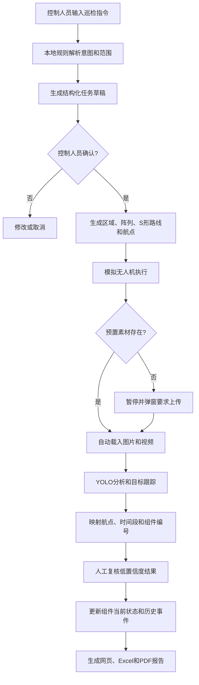
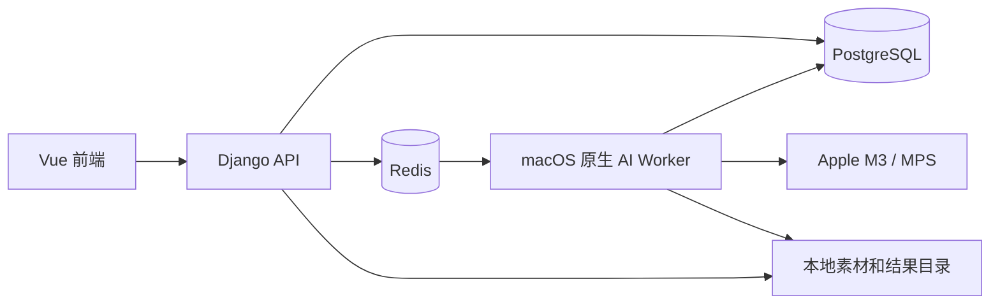

# 绿能先锋 V1 需求规格说明书

> 文档状态：需求基线，可进入开发  
> 版本：V1.0  
> 目标场景：比赛答辩演示，同时保留面向真实光伏电站控制人员的业务结构  
> 部署范围：单台 Apple M3、24 GB 内存的 MacBook Air 本地运行  
> 界面基线：`opendesign/mockups/solar-inspection-styles/index.html`

## 1. 产品定义

“绿能先锋”是一套面向光伏电站控制人员的本地无人机巡检分析系统。系统接收普通 RGB 图片和视频，使用 YOLO 对整块光伏组件进行框选，并输出三类业务状态：

- 正常
- 需要清洗
- 需要维修

系统同时提供电站地图、任务调度、报告导出、困难样本标注、模型训练管理，以及可查询系统数据库并生成巡检任务的文字智能助手。

V1 的核心演示闭环为：

> 文字下达巡检指令 → 生成结构化任务草稿 → 控制人员确认 → 模拟无人机按路线巡检 → 自动载入素材并识别 → 更新组件状态 → 汇总结果 → 导出巡检报告。

## 2. 建设目标与成功标准

### 2.1 产品目标

1. 在 2～3 分钟答辩时间内稳定演示完整业务闭环。
2. 所有核心演示功能在断网情况下仍可运行；仅非预设智能问答允许依赖云端 API。
3. 数据结构应支持后续接入真实无人机、真实电站地图、GPS 和更细粒度视觉模型。
4. 尽量减少巡检人员参与；控制人员主要负责确认任务、复核低置信度结果和处理异常。

### 2.2 V1 验收指标

- 支持一次上传多张图片和一个 2～3 分钟、1080p 视频。
- 页面展示排队、上传、识别、复核、完成和失败等状态及真实处理百分比。
- 图片和结果视频上能够显示组件框、三类标签与置信度。
- 视频按每秒 2～5 帧抽样识别，并通过跟踪补充相邻帧检测框。
- 完成后可播放结果视频，并展示异常关键帧。
- 识别结果能映射到电站—区域—阵列—光伏板编号。
- 能从一句文字指令生成巡查任务，经人工确认后模拟执行。
- 能显示 240 块光伏板的俯视网格状态。
- 能生成网页报告并导出 Excel 和 PDF。
- 规则型智能助手在无网络时能正确回答预置问题、查询数据库并生成任务。
- 阶段性模型目标：总体准确率不低于 85%，维修类召回率不低于 90%；低置信度结果进入人工复核。该指标需在独立验证素材上测量，不得使用训练数据冒充验证数据。

## 3. 用户与权限

### 3.1 V1 业务角色

仅设计一个前台业务角色：控制人员。

控制人员可以：

- 注册和登录；
- 上传图片、视频和区域备注；
- 复核、修改识别结果；
- 查询电站、区域和组件状态；
- 下达并确认巡检任务；
- 查看和导出报告；
- 使用人工标注和训练管理功能。

### 3.2 管理员

管理员只通过 Django Admin 使用管理能力：

- 审核新注册账户；
- 启用、停用账户；
- 分配所属电站；
- 查看必要的后台数据。

新用户注册后状态为“待审核”，管理员审核通过后才可登录。系统右上角显示当前“控制人员”账户名称，并提供退出和修改密码。

## 4. 页面信息架构

### 4.1 登录与注册

- 登录：账号、密码、记住登录状态、登录反馈。
- 注册：账号、姓名、密码、确认密码等最小必要字段。
- 注册完成后提示“等待管理员审核”。
- 被拒绝、未审核和已停用账户应有明确提示。

### 4.2 左侧导航

1. 识别与助手（默认首页）
2. 任务中心
3. 报告中心
4. 电站地图
5. 模型训练
6. 历史数据
7. 系统设置

### 4.3 识别与助手

采用三栏专业控制台布局，并以当前 OpenDesign 原型为视觉基线。

#### 主识别区

- 初始状态显示大面积拖拽/选择上传窗口。
- 支持多张图片加一个视频批量上传。
- 提交前填写一段区域备注。
- 上传后，原上传区域切换为当前识别结果。
- 下方持续累积显示本批次所有文件卡片。
- 文件状态至少包括：待上传、上传中、排队中、识别中、待复核、已完成、失败。
- 视频识别时显示处理百分比、当前帧/时间、预计状态。
- 完成后展示结果视频、三类统计和异常关键帧。
- 支持查看原图/原视频与结果图/结果视频。
- 控制人员能够确认、修改和归档识别结果。

#### 智能助手区

- V1 仅支持文字输入。
- 展示本地规则可用、云端 API 可用性和当前回答来源。
- 生成任务时必须先展示结构化草稿，并等待控制人员确认，不得直接执行。
- 非预设问题才调用云端 API；API 不可用时明确提示，不得编造答案。

### 4.4 任务中心

- 列表展示任务编号、区域、阵列、状态、进度、创建时间、开始时间、完成时间。
- 状态建议：草稿、待确认、已排队、执行中、等待素材、分析中、已完成、已取消、失败。
- 任务详情展示区域范围、S 形路线、航点、素材、识别进度、异常数量和事件时间线。
- 预置素材存在时自动载入并分析。
- 预置素材不存在时暂停任务并弹窗要求上传，上传后从暂停处继续。

### 4.5 报告中心

- 网页展示任务基本信息、路线、三分类统计、区域/阵列汇总、异常明细、关键截图和智能建议。
- 支持导出 Excel 和 PDF。
- PDF 不需要签字或盖章位置。
- Excel 至少包含“组件明细”和“汇总统计”工作表。

### 4.6 电站地图

- 作为左侧独立页面展开。
- 使用可控的光伏阵列俯视网格图，不使用复杂 GIS 地图作为 V1 主视图。
- 支持电站 → 区域 → 阵列 → 行列 → 组件的多级锁定和钻取。
- 按状态着色显示正常、需要清洗、需要维修、识别中和未知。
- 点击组件展示当前状态、最近识别时间、异常原因、历史记录和关联任务。
- 展示无人机固定 S 形蛇形路线、当前位置和覆盖率。

### 4.7 模型训练

- 困难样本池只收集低置信度、识别失败和人工修改过的样本，并进行近重复过滤。
- 提供图片/视频关键帧导入。
- 使用已有模型自动生成候选框；人工可新增、移动、缩放、删除检测框。
- 标注类别固定为正常、需要清洗、需要维修。
- 支持数据集版本、训练/验证划分、YOLO 格式导出。
- 支持创建本地训练任务并查看损失、Precision、Recall、mAP 和混淆矩阵。
- 本地训练不适配或过慢时，生成标准数据包和命令，由用户手动上传云端 GPU；V1 不自动上传数据。
- 模型版本切换前必须人工确认，并记录启用时间和操作者。

## 5. 电站与编号规则

### 5.1 演示电站

- 1 个电站；
- 东、南、西、北 4 个区域；
- 每个区域 3 个阵列；
- 每个阵列 20 块光伏板；
- 总计 240 块光伏板；
- 自动生成 30 天历史数据。

### 5.2 阵列布局

每个阵列固定为 4 行 × 5 列。

- 数据库完整编号示例：`A2-R01-C01`
- 页面简短编号示例：`A2-001`

完整编号必须在所属电站和区域范围内唯一。页面短编号用于展示，不作为全局唯一键。

### 5.3 位置来源

不得通过普通组件画面猜测所属区域。位置来源按优先级处理：

1. 已确认巡检任务及其航点；
2. 上传备注解析结果；
3. 文件元数据或未来 GPS/二维码；
4. 控制人员补充确认。

智能助手从备注中提取电站、区域、阵列和组件编号；缺失或存在歧义时，必须要求用户确认。

## 6. 视觉识别规则

### 6.1 检测目标与类别

YOLO 检测对象是“整块光伏板”，V1 只训练三个类别：

| 类别 | 业务含义 | 推荐颜色 |
|---|---|---|
| normal | 正常 | 绿色 |
| cleaning | 需要清洗 | 橙色 |
| repair | 需要维修 | 红色 |

积灰、鸟粪、遮挡、裂纹、可见黑化等作为 `reason` 辅助字段，由规则、演示数据或人工复核补充，不增加为 V1 YOLO 类别。

### 6.2 RGB 能力边界

V1 只接收普通 RGB 图片和视频，不能声称仅凭 RGB 完成专业热斑诊断。

发现明显黑点/黑化时：

- 业务类别：需要维修；
- 对外描述：检测到可见黑化，疑似热斑，建议红外复检。

### 6.3 低置信度

- 默认低置信度阈值为 0.75，可在系统设置中调整。
- 低于阈值的结果进入人工复核队列。
- 低置信度不得静默计入最终业务统计，除非控制人员确认。

### 6.4 视频处理

- 原视频通常为 30 FPS，但模型只分析每秒 2～5 帧；默认建议 3 FPS。
- 使用目标跟踪为相邻帧补充检测框。
- 页面显示真实任务进度。
- 输出带检测框和标签的结果视频。
- 自动抽取异常关键帧，便于快速定位。
- 原视频和结果视频短期保留用于对照；建议默认 7 天后可清理。
- 异常关键截图和统计数据长期保存。

## 7. 任务执行流程

### 7.1 预设演示指令

至少保证以下意图离线可用：

1. 查询某区域当前状况。
2. 查询某区域近 7 天或 30 天清洁趋势。
3. 查询待清洗组件。
4. 查询待维修组件。
5. 查询指定组件历史。
6. 生成一个或多个区域的巡检任务。
7. 查询任务进度。
8. 生成或导出巡检报告。
9. 查询困难样本、标注或训练进度。
10. 手动关闭清洗或维修事件。

### 7.2 示例任务

- “巡查北区全部三个阵列。”
- “巡查东区 A1 和 A2 阵列，重点检查需要维修的组件。”
- “对南区执行完整巡检，结束后生成 PDF 和 Excel 报告。”

## 8. 异常状态闭环

- 每次识别产生不可删除的历史识别记录。
- 当前异常以独立事件形式管理，不直接覆盖历史。
- 控制人员可以手动把清洗/维修事件标记为已处理。
- 后续巡检重新识别为正常时，可以自动关闭对应当前异常，但必须保留关闭原因、时间和关联识别记录。
- 同一组件以后再次异常时创建新事件，不复用已关闭事件。
- V1 不做即时维修报警，只在区域、阵列和报告中累计展示待维修数量。

## 9. 智能助手范围

### 9.1 本地优先

V1 本地助手不是通用大语言模型，而是：

- 意图识别和槽位提取；
- PostgreSQL 数据查询；
- 统计计算；
- 任务草稿生成；
- 预置模板回答。

这部分必须在完全离线时稳定运行。

### 9.2 云端回退

- 仅当问题无法匹配本地意图时调用云端 API。
- 发送云端前应尽量只发送必要的结构化统计，不发送原始视频。
- API 密钥通过环境变量配置，不写入前端或代码仓库。
- API 超时或断网时提示“当前问题需要联网服务”，不得生成无来源的结果。

## 10. 数据与训练计划

### 10.1 已有数据

- 约 30～40 张未标注 RGB 图片；
- 三种业务状态均有覆盖；
- 2 段未标注视频；
- 一段视频用于抽帧和训练，另一段保留为独立演示/验证素材。

### 10.2 初始训练策略

1. 从训练视频中按画面变化抽帧并去重。
2. 使用预训练模型生成光伏板候选框。
3. 人工修正候选框并标注三个类别。
4. 首轮完成约 100～150 张种子标注。
5. 训练小型 YOLO 模型，再自动预标注剩余素材。
6. 补充许可清晰、视角相近的公开 RGB 光伏板数据集。
7. 使用适度亮度、阴影、模糊、旋转和透视增强。
8. 逐步扩展到约 300～600 张有效标注图像。

同一视频的相邻帧不得同时进入训练集和验证集，以避免数据泄漏和虚高指标。公开数据必须记录来源、许可证、下载日期和转换规则。

## 11. 技术架构基线

### 11.1 技术选型

- 前端：Vue 3 + TypeScript + Vite
- 后端：Django + Django REST Framework
- 主数据库：PostgreSQL
- 任务队列与临时状态：Redis + Celery
- AI：Ultralytics YOLO + PyTorch MPS + OpenCV + 目标跟踪
- 文件：Mac 本地文件目录
- 容器：Docker Compose 运行 Django、PostgreSQL、Redis；YOLO Worker 不进入 Docker
- 报告：后端生成 Excel 和 PDF

### 11.2 服务关系

### 11.3 存储职责

- PostgreSQL：账户、电站结构、组件、识别记录、异常事件、任务、报告、数据集和模型版本。
- Redis：Celery 队列、临时进度、短期缓存和互斥锁。
- 本地文件夹：原始图片/视频、结果视频、异常截图、训练数据和模型权重。
- 不得把大型图片或视频内容写入 Redis；队列只传任务 ID、文件 ID 或共享路径。

### 11.4 原生 AI Worker

AI Worker 直接运行在 macOS Python 虚拟环境中，以使用 `device="mps"`。它从 Redis 领取任务，加载模型一次后持续处理素材，写入进度，生成结果文件，并把最终结构化结果持久化到 PostgreSQL。

首版使用 PyTorch MPS 推理和训练；性能不足时再评估导出 Core ML。M3 Mac 仅承担轻量模型和小数据集训练，重训练由用户手动上传标准 YOLO 数据包至云端 GPU。

## 12. 核心数据实体

至少包括：

- User / ControlOperator：账户、审核状态、所属电站。
- Station：电站。
- Region：东南西北区域。
- Array：阵列及 4×5 布局。
- Panel：完整编号、短编号、行列、当前状态。
- MediaAsset：原始素材、结果素材、关键帧、保留策略。
- UploadBatch：批量上传和区域备注。
- RecognitionJob：队列任务、进度、模型版本、错误信息。
- Detection：检测框、类别、置信度、原因、帧时间。
- InspectionTask：任务草稿、确认、范围、路线和状态。
- Waypoint：航点、顺序、阵列、行列和视频时间段映射。
- AbnormalEvent：清洗/维修事件、开启和关闭方式。
- Report：网页数据、PDF、Excel及生成时间。
- DatasetVersion：数据集快照、划分和来源。
- Annotation：人工标注和修改记录。
- TrainingRun：参数、状态、指标和输出模型。
- ModelVersion：权重、类别、阈值、启用状态。
- AgentConversation / AgentAction：问题、回答来源、任务草稿和确认记录。

## 13. 非功能要求

- 桌面端优先适配 1920×1080 和外接 4K 屏幕；关键正文不得依赖过小字号。
- 界面采用成熟、克制的深色工业控制台风格，避免卡通化和装饰性渐变堆叠。
- 左上角品牌为绿色圆形闪电图标和“绿能先锋”。
- 所有长任务必须异步执行，不得阻塞 Django 请求。
- Worker 异常退出后任务应可重试；任务处理应尽量幂等。
- 正式业务状态以 PostgreSQL 为准，Redis 丢失不得导致历史数据消失。
- 上传文件限制类型和大小，服务端重新验证 MIME 类型。
- 密码使用 Django 标准哈希；所有关键修改记录操作者和时间。
- 本地演示应提供一键启动、健康检查、演示数据初始化和重置脚本。

## 14. V1 明确不做

- 不接入真实无人机飞控和实时摄像头。
- 不通过视觉画面猜测区域或组件编号。
- 不做红外热成像诊断。
- 不训练积灰、鸟粪、裂纹等细粒度原因模型。
- 不自动把训练数据上传云端。
- 不提供多种前台业务角色。
- 不部署公网服务器或移动端应用。
- 不要求签字、盖章和正式工单审批流。
- 不把自由问答包装成全知本地大模型。

## 15. 推荐开发里程碑

### M1：工程与账号

- 初始化 Vue、Django、PostgreSQL、Redis 和 Docker Compose。
- 完成登录、注册、管理员审核和演示数据初始化。

### M2：识别闭环

- 完成批量上传、区域备注、文件状态和识别任务。
- 接入 macOS 原生 AI Worker，先使用模拟结果，再替换为真实 YOLO。
- 完成结果视频、关键帧和人工复核。

### M3：地图与任务

- 完成 240 块组件地图、S 形路线、多级锁定。
- 完成自然语言任务草稿、人工确认、模拟执行和状态更新。

### M4：报告与智能助手

- 完成统计查询、10 类本地意图和 API 回退。
- 完成网页报告、Excel 和 PDF 导出。

### M5：标注与训练

- 完成困难样本池、标注工具、数据集版本、训练记录和模型切换。
- 整理自有与公开数据，训练并验证首版模型。

### M6：答辩加固

- 固定演示素材和演示路线。
- 完成断网、API 失败、素材缺失、Worker 重启和导出测试。
- 编写一键启动和 2～3 分钟答辩脚本。

## 16. 开发前待提供材料

这些是开发输入，不是未决需求：

- 30～40 张原始图片；
- 两段视频，并标明训练视频和保留演示视频；
- 云端智能问答 API 的供应商、模型和密钥（可晚于本地规则功能提供）；
- 比赛截止日期和最终答辩分辨率；
- 最终 Logo 源文件（若当前闪电图标不是最终版本）。

## 17. 需求变更原则

本文件作为 V1 开发基线。任何新增需求先判断是否影响三条核心链路：识别、任务、报告。影响数据结构、角色权限、真实设备控制或部署范围的变化，应单独列为变更项；纯视觉、文案和阈值调整可作为配置或迭代优化处理。
